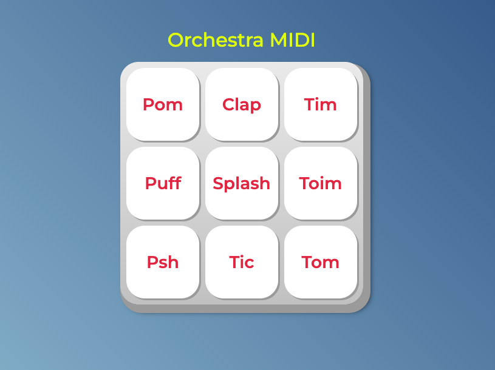

# Orchestra MIDI

## Description

Orchestra MIDI is a web application that allows you to play musical sounds by clicking buttons or using the keyboard. Each button on the screen represents a different sound, which can be triggered by mouse click or by pressing the spacebar or Enter key.

## Main Screen

## How to Use

1. Clone this repository or download the files.
2. Ensure the sound files are in the correct directory (`sounds/`).
3. Open the `index.html` file in a web browser.
4. Click on the buttons or use the space bar and Enter key to play the sounds.

## Technologies Used

- HTML
- CSS
- JavaScript

This is my first project. 

